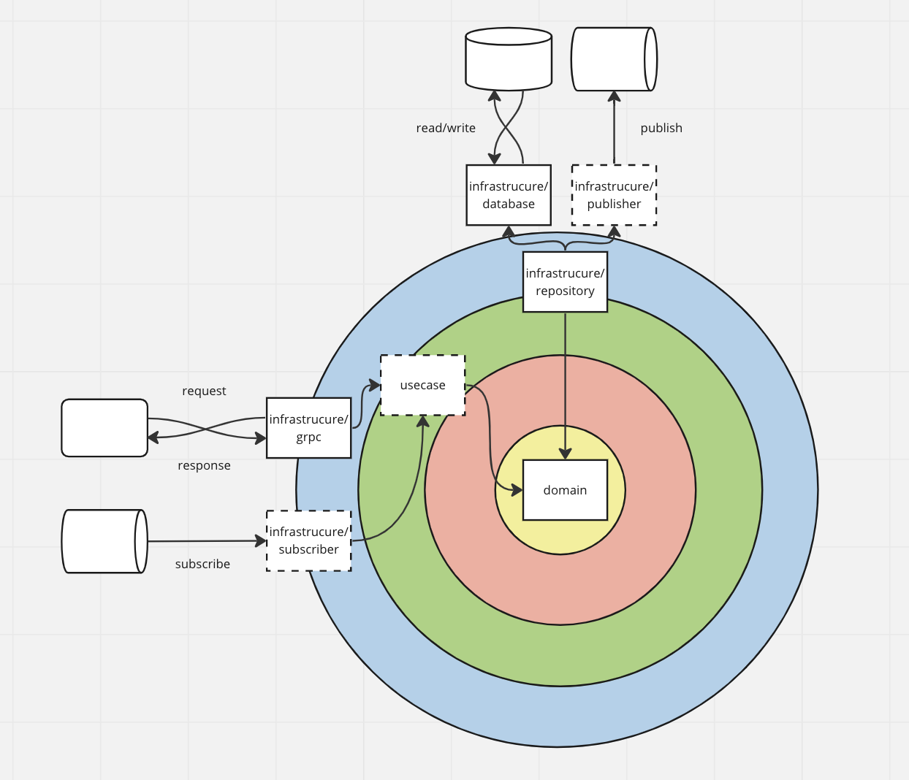
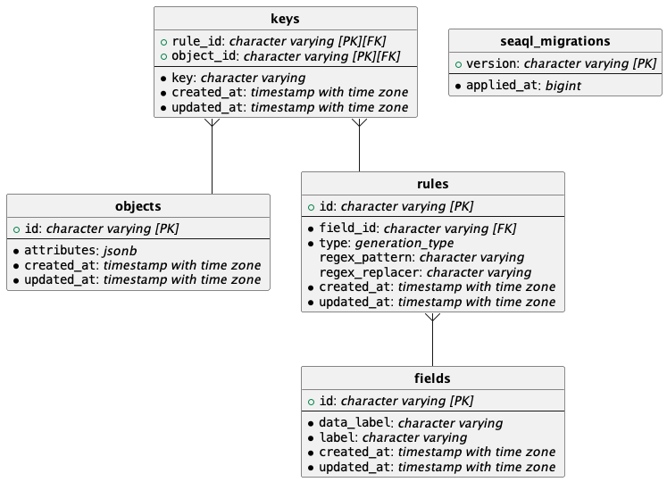

# poo-pad-pong
I love poo pad pong curry

# Setup
Install Rust

```console
curl --proto '=https' --tlsv1.2 -sSf https://sh.rustup.rs | sh
```

Install some crates

```console
cargo install cargo-make
cargo install sea-orm-cli
```

setup `.env` file

```console
cp .env.sample .env 
```

# Run

Start database(PostgreSQL):

```console
docker-compose up
```

Migrate Database:

```console
sea-orm-cli migrate up
```

Start gRPC Server:

```console
cargo make start
```

# Usage
## Lint

```console
cargo make lint
```

```console
cargo make fix
```

## Format

```console
cargo make format
```

## Test

```console
cargo make test
```

# Architecture



Created by [@achiku/planter](https://github.com/achiku/planter)


